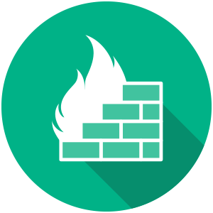

# Network Infrastructure Modernization for NPO
Installed a FortiGate firewall and a Netgear managed switch to secure and optimize the organization's network. This installation improved firewall protection and network administration, ensuring the organization's stable connectivity.

## Environments and Technologies Used

- FortiGate-60E Firewall
- Netgear M4100-24G-POE+ Managed Switch

## Operating Systems Used

- macOS High Sierra

## High-Level Deployment and Configuration Steps

- Install switch and firewall in rack and perform firmware updates
- Connect firewall to WAN device and switch
- Access the firewall's web management interface by navigating to its default IP and comoplete the initial setup wizard
    - timezone
    - admin password
    - enable network interfaces
- Configure WAN interface with settings from ISP
- Confgiure LAN interface IP address range, subnet mask, default gateway, and DHCP server
- Configure security policies
    - Antivirus
    - Web Filter
    - DNS Filter
    - FortiClient Profiles
- Configure SSL VPN
    - create local users or connect to an LDAP or RADIUS server
    - assign users to VPN group
    - assign group to SSL-VPN
    - configure DNS on VPN
- Configure logging and reporting for all desired events

